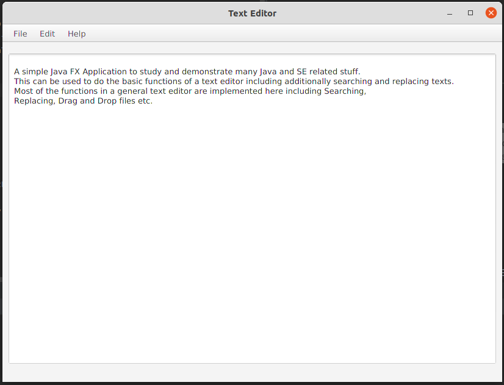
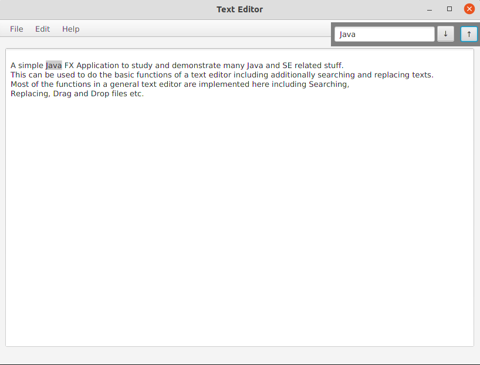
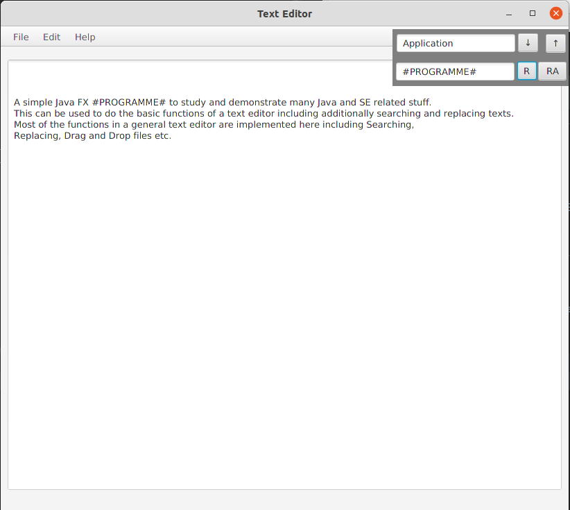
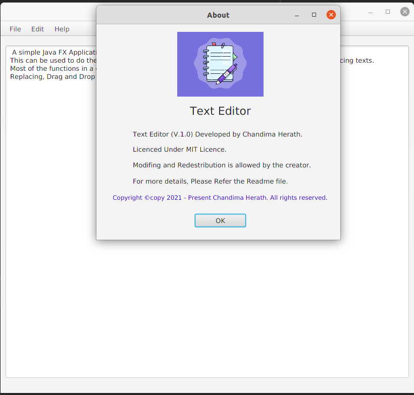

# Text Editor

---
---

### Contents of this file
* Introduction
* User guide to use
* License

---

### Introduction

* A simple *Java FX Application* to study and demonstrate many Java and SE related stuff.
* This can be used to do the basic functions of a text editor including additionally searching and replacing texts.
* Most of the functions in a general text editor are implemented here including Searching, Replacing,
  Drag and Drop files, Printing content etc.

---
       (Main View)

 

---
      (Search View)

 
---
---
    (Replace View)

---

    (About)

---

### How to use this repository?

1. First clone the repository.

   https://github.com/ChandimaHerath/TextEditor.git

2. Once cloned, open the repository from the IntelliJ IDEA

3. Build and Run!

---

### License

Copyright &copy; 2021 - present Chandima Herath. All rights reserved.

Licensed under the [MIT](LICENSE) license
